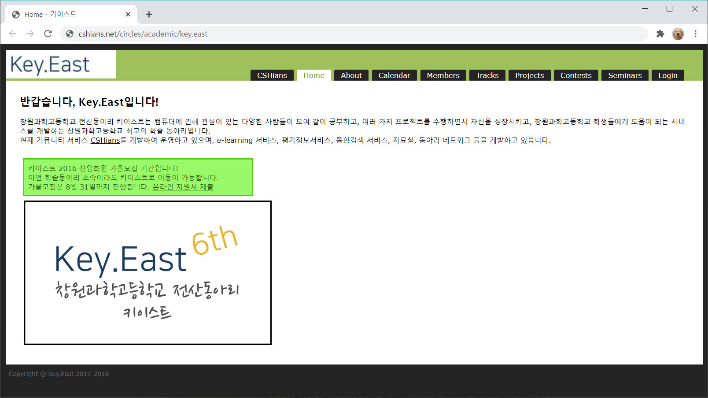

# 창원과학고등학교 전산동아리 Key.East 홈페이지

![markup-html][markup-html]
![language-php][language-php]
 
![participants-solo][participants-solo]
 
[![copyright-sparcs][sparcs-image]][sparcs-url]
[![copyright-algospot][algospot-image]][algospot-url]

> 창원과학고등학교 전산동아리 Key.East에서 2016년 6월에 사용한 홈페이지입니다.

### 스크린샷

### 개발 기간

2016년 상반기 중 2주

### 구현 사항

현재 로그인 관련 소스가 유실되어 소스를 찾아보는 중입니다.

  * 탭을 갖춘 간단한 동아리 홈페이지 제작
  * `유실` 로그인 기능을 PHP 세션 핸들러로 구현

### 라이선스 및 공동체 수정

이곳의 소스 코드에는 다음의 소스 코드가 포함되어 있습니다.

  * [KAIST][kaist-url] [SPARCS][sparcs-url]의 예전 홈페이지의 소스 코드
  * [Algospot][algospot-url] [Coder's High 2016][coders-high-url]의 웹페이지의 소스 코드

이곳은 개인 프로젝트 백업을 목적으로 하는 저장소입니다.

  * 모든 제3자 사용을 허가하지 않습니다.
  * 모든 제3자 수정을 승인하지 않습니다.
    * 깃허브 Pull Request를 받지 않습니다.

<!-- Image definitions -->
[sparcs-image]: https://img.shields.io/badge/Copyright-SPARCS-eba02a
[algospot-image]: https://img.shields.io/badge/Copyright-Algospot-ff0000
[markup-html]: https://img.shields.io/badge/Markup-HTML-orange
[language-php]: https://img.shields.io/badge/Language-PHP-orange
[participants-solo]: https://img.shields.io/badge/Participants-Solo%20Project-7aa3cc
[kaist-url]: http://kaist.ac.kr
[sparcs-url]: https://sparcs.org
[algospot-url]: https://algospot.com
[coders-high-url]: https://algospot.com/forum/read/3698
